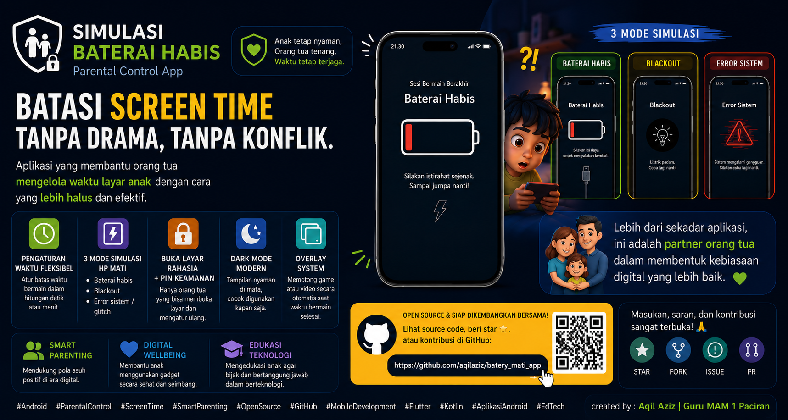

# 📱 DESKRIPSI APLIKASI — Simulasi Baterai Habis

**Simulasi Baterai Habis** adalah aplikasi *Parental Control* (Kontrol Orang Tua) yang cerdas dan ramah anak untuk membantu membatasi waktu layar (*screen time*) tanpa memicu kemarahan, kesedihan, atau tangisan.

Aplikasi ini bekerja dengan menyimulasikan kondisi alami ketika ponsel “mati” karena baterai habis atau mengalami gangguan sistem. Dengan cara ini, anak cenderung mengira permainan berhenti karena HP kehabisan daya, sehingga mereka lebih mudah dan sukarela mengembalikan ponsel kepada orang tua.

Aplikasi ini dirancang untuk membantu orang tua menerapkan pola asuh digital (*smart parenting*) secara lebih bijak, terutama dalam mengurangi ketergantungan gadget pada anak, melatih disiplin waktu, serta menciptakan kebiasaan penggunaan teknologi yang lebih sehat sejak dini.

---

# 🌟 Manfaat & Kegunaan

* Membantu mengurangi ketergantungan anak terhadap gadget.
* Mengurangi drama, tangisan, atau kemarahan saat HP diminta kembali.
* Membantu menerapkan aturan *screen time* dengan lebih konsisten.
* Mendukung pola asuh digital yang sehat dan modern.
* Cocok digunakan saat anak bermain game, menonton YouTube, atau menggunakan aplikasi hiburan lainnya.
* Membantu orang tua menjaga kontrol penggunaan HP secara aman dan nyaman.

---

# 🌟 Fitur & Keunggulan Utama

## ⏱️ Pengaturan Waktu Fleksibel (Detik & Menit)

Orang tua dapat mengatur durasi penggunaan HP dengan lebih presisi melalui:

* Tombol cepat (*preset*) mulai dari:
  * 10 detik
  * 30 detik
  * hingga beberapa menit
* Input waktu kustom dalam satuan:
  * menit
  * detik

Pengaturan ini memudahkan orang tua menyesuaikan waktu bermain sesuai kesepakatan dengan anak.

---

# 🔌 3 Mode Simulasi HP Mati (Realistis)

## 1. Klasik — Baterai 0% Flashing

Menampilkan indikator baterai merah tipis yang berkedip sebelum layar meredup dan mati total.

Efek ini menyerupai perilaku asli Android saat baterai benar-benar habis.

---

## 2. Seketika Mati (*Blackout*)

Layar langsung menjadi hitam total tanpa peringatan, seperti HP yang tiba-tiba kehabisan daya.

---

## 3. Error Sistem (*Glitch*)

Layar berkedip dengan teks hijau bergaya *critical system error* selama beberapa detik sebelum akhirnya gelap sepenuhnya.

---

# 🔒 Sistem Pembuka Layar Rahasia (Anti-Siasat Anak)

Ketika layar sudah berubah menjadi hitam total, sentuhan normal di area layar akan diblokir agar anak tidak bisa membuka permainan kembali.

Untuk membuka layar:

1. Orang tua mengetuk **7 kali berturut-turut** di **pojok kiri atas**.
2. Pada ketukan ke-6 akan muncul petunjuk:

   > “Kurang 1 ketukan lagi!”

3. Setelah ketukan ke-7 berhasil, akan muncul:
   * keypad PIN rahasia
   * PIN bawaan: **1234**
4. Orang tua dapat mengganti PIN 4 digit melalui menu pengaturan utama.

---

# 🎨 Antarmuka Gelap Modern & Nyaman di Mata

Mengusung desain **Material 3 Dark Theme** dengan tampilan gelap elegan yang:

* nyaman digunakan pada malam hari,
* lebih hemat baterai,
* ramah untuk mata.

---

# 👨‍🏫 Kredit & Dedikasi

Aplikasi ini dikembangkan sebagai bagian dari dedikasi terhadap:

* pendidikan teknologi,
* pengasuhan digital yang sehat (*smart parenting*).

### 👤 Created by

**Aqil Aziz**

### 🏫 Peran / Instansi

**Guru IT MAM 1 Paciran**

---

# ⚙️ Persyaratan Sistem & Perizinan

## 🪟 Tampil di Atas Aplikasi Lain (*Draw Overlays*)

Diperlukan agar aplikasi dapat menampilkan simulasi layar mati di atas:

* game,
* YouTube,
* aplikasi lain yang sedang digunakan anak.

---

## 🔔 Akses Notifikasi (Android 13+)

Digunakan agar timer tetap berjalan stabil di latar belakang (*foreground service*) dan tidak dihentikan otomatis oleh sistem manajemen RAM Android.

---

# 📦 Informasi Build

* Platform: Android
* Minimum Android: Android 7.0 (API 24)
* Target Android: API 36
* Format rilis: APK
* Nama APK rilis mengikuti format versi, contoh: `simulasi-baterai-habis-v1.apk`, `simulasi-baterai-habis-v2.apk`, dan seterusnya.

---

# 📄 Lisensi

Project ini dirilis sebagai perangkat lunak open source dengan lisensi **MIT License**.

Lihat file [`LICENSE`](LICENSE) untuk detail lisensi.
